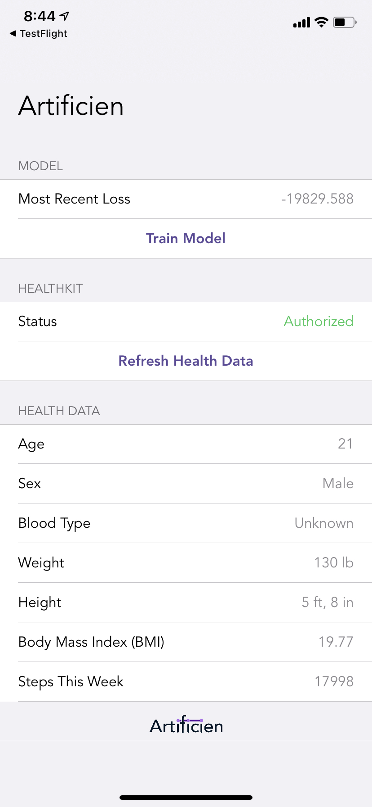

# Artificien: iOS

This is the main proof-of-concept mobile companion to the Artificien platform. This repo stores a demo application that stores user health data from Apple Health and exposes it to the Artificien platform for learning/analysis.

TODO: super short project description, some sample screenshots or mockups that you keep up-to-date.

## Architecture

TODO:  overall descriptions of code organization and tools and libraries used

## Setup

TODO: how to get the project dev environment up and running, npm install etc, all necessary commands needed, environment variables etc

* Download XCode
* Open `.xcodeproj` file in `Artificien` sub-directory
* Run the project with `Cmd` + `R` or by selecting the play icon at the top left of the XCode editor

## Deployment

TODO: how to deploy the project

## Authors

Shreyas Agnihotri, '21

## Acknowledgments
