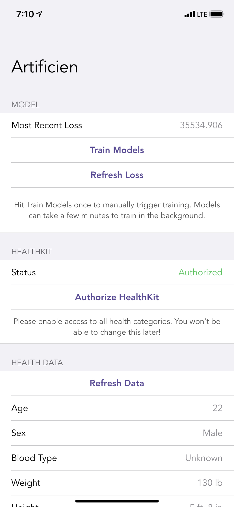

# Artificien: iOS

This is the main proof-of-concept mobile companion to the Artificien platform. This repo stores a demo application that stores user health data from Apple Health and exposes it to the Artificien platform for learning/analysis.



TODO: super short project description, some sample screenshots or mockups that you keep up-to-date.

## Architecture

TODO:  overall descriptions of code organization and tools and libraries used

## Setup

TODO: how to get the project dev environment up and running, npm install etc, all necessary commands needed, environment variables etc

### Artificen Mobile

* Download XCode
* Open `.xcodeproj` file in `Artificien` sub-directory
* Run the project with `Cmd` + `R` or by selecting the play icon at the top left of the XCode editor

### SwiftSyft Tutorial

Full code:

```
pip install poetry
cd apps/node
poetry install
./run.sh --id bob --port 5000 --start_local_db
cd ../../SwiftSyftTutorial
jupyter notebook
cd SwiftSyft
pod install
```

* Install poetry — `pip install poetry`
* Run `poetry install` in `apps/node`
* Start the PyGrid node manually using `./run.sh --id bob --port 5000 --start_local_db` in `apps/node`
* Run `jupyter notebook` in the `SwiftSyftTutorial` sub-directory
* Navigate to the localhost addressed specified in the output of the above command
* Run the entire jupyter notebook, using `pip install` to add python packages as needed
* Navigate to `SwiftSyftTutorial/SwiftSyft` and run `pod install`
* Open the `.xcworkspace` file and run it to start the app

## Deployment

TODO: how to deploy the project

## Authors

Shreyas Agnihotri, '21

## Acknowledgments
